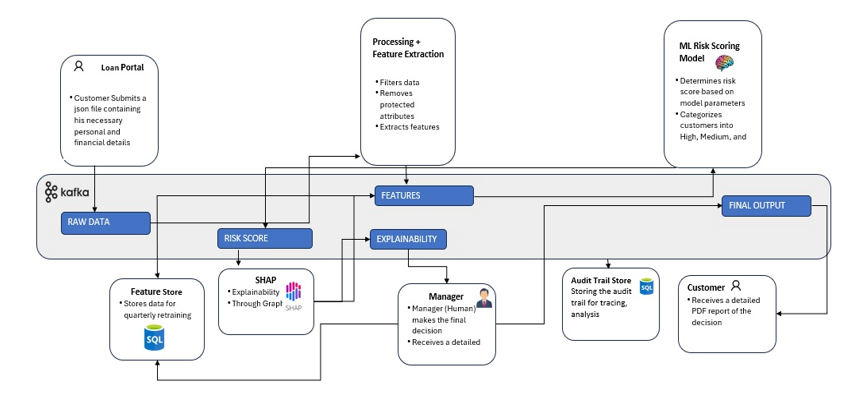
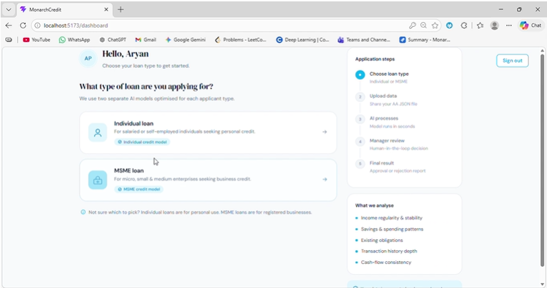
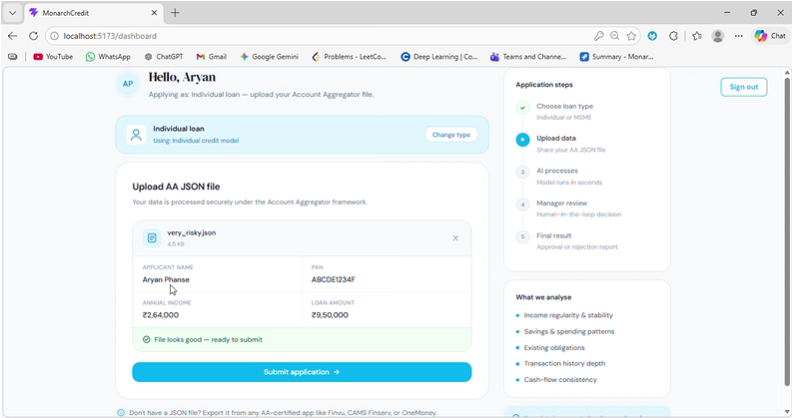
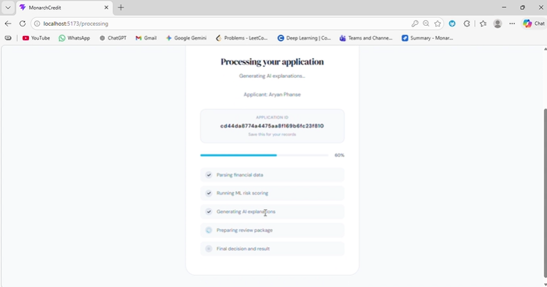
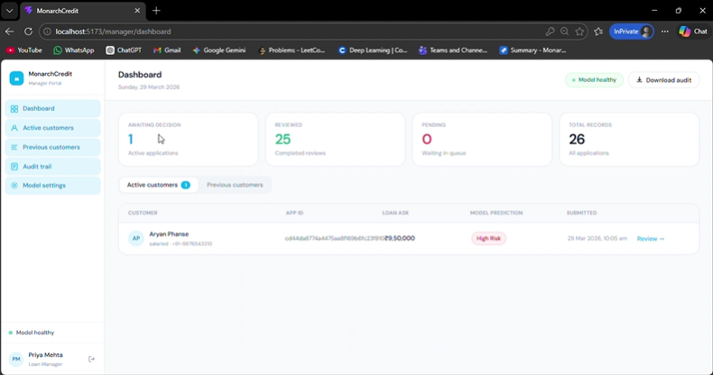
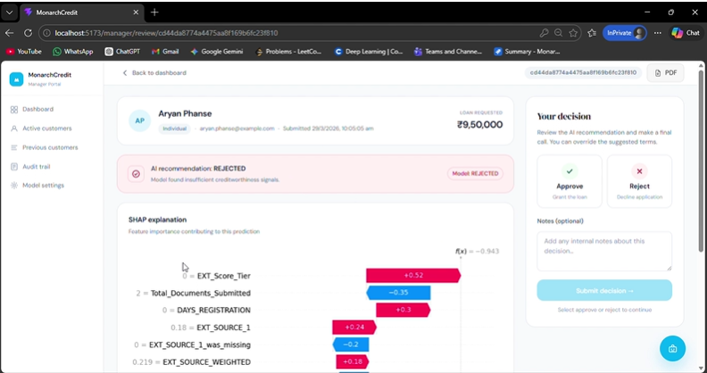
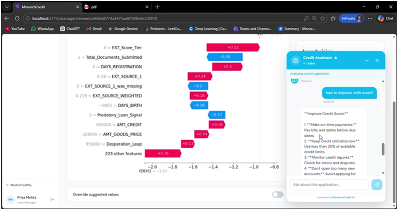

# 🏦 MonarchCredit – AI Powered Alternate Credit Scoring System

🚀 Built for **Barclays Hack-O-Hire 2026**

MonarchCredit is an AI-powered alternate credit scoring platform designed to enable **financial inclusion** by evaluating the creditworthiness of **unbanked and underbanked individuals as well as MSMEs**, beyond traditional CIBIL-based systems.

---

## 📌 Problem Statement

Millions of individuals and MSMEs lack formal credit histories, making them invisible to traditional credit scoring systems. As a result, many creditworthy applicants are denied access to fair lending opportunities. MonarchCredit addresses this gap by using alternative financial signals, machine learning, and explainable AI to assess creditworthiness more inclusively and transparently.

👉 MonarchCredit solves this by:
- Leveraging **behavioral financial data**
- Using **AI-driven risk assessment**
- Providing **transparent and explainable decisions**

---

## 💡 Solution Overview

The system processes structured financial data (simulating Account Aggregator flows) and generates:

- 📊 **Risk Score**
- 💳 **CIBIL-style Credit Score**
- ✅ **Loan Approval / Rejection Decision**
- 💰 **Suggested Loan Terms (Principal & Interest Rate)**

---

## 🧠 Key Features

### 🔹 Dual AI Models
- Separate models for:
  - **Individuals**
  - **MSMEs**
- Tailored features and signals for each segment

---

### 🔹 Responsible Data Processing
- Removes **protected attributes** (gender, religion, etc.)
- Ensures **fairness and unbiased evaluation**

---

### 🔹 Advanced Feature Engineering
- Raw data is transformed into **handcrafted features**
- Captures:
  - Income stability  
  - Financial behavior  
  - Asset-liability balance  
  - Social and behavioral signals  

---

### 🔹 Ensemble ML Decision Engine
Built using:
- **XGBoost**
- **Random Forest**
- **LightGBM**

👉 Outputs:
- Risk score  
- Loan decision  
- Suggested interest rate & principal  

---

### 🔹 Explainable AI (SHAP)
- Every decision is **interpretable**
- Shows feature-level contribution for each applicant

---

### 🔹 Human-in-the-Loop System
- Managers can:
  - Accept model decision  
  - Override decisions if necessary  

👉 Ensures real-world practicality and trust

---

### 🔹 Dual User Interfaces

#### 👤 Customer Interface
- Upload financial JSON (Account Aggregator simulation)
- View:
  - Credit score  
  - Decision  
  - Personalized report  

#### 🧑‍💼 Manager Interface
- Review applications  
- View SHAP explanations  
- Override decisions  
- Generate reports  

---

### 🔹 Automated PDF Reports
- 📄 Customer Report  
- 📄 Manager Report  

Includes:
- Decision summary  
- Risk insights  
- Loan details  
- Explanation  

---

### 🔹 AI Chatbot 🤖
An intelligent assistant that can:
- Explain **why an applicant was rejected**
- Compare **multiple applicants**
- Help customers understand their reports  
- Assist managers with decision insights  
- Answer finance-related queries  

---

### 🔹 Event-Driven Architecture (Kafka)

The system uses **Apache Kafka** as its backbone:

- ⚡ Asynchronous processing  
- 🔗 Loose coupling between services  
- 🛡 Fault tolerance  
- 📈 High scalability  

👉 Each service:
- Consumes from a topic  
- Publishes to another topic  

👉 Even if a service fails:
- System continues running  
- No data loss (Kafka persists data)

---

### 🔹 Audit Trail & Compliance
- Stores:
  - Customer data  
  - Model outputs  
  - Manager decisions  
  - Governance metadata  

👉 Enables:
- Regulatory compliance  
- Risk tracking  
- Transparency  

---

### 🔹 Feature Store (Continuous Learning)
- Engineered features are stored  
- Used for:
  - Future model retraining  
  - Performance improvement  

---

## 🏗️ System Architecture

<p align="center">
  
</p>

Kafka acts as the backbone of the system, enabling asynchronous processing, loose coupling, fault tolerance, and scalability across all services.

---

## 📸 Demo & Screenshots

### 👤 Customer Flow

#### 🏠 Customer Dashboard
<p align="center">
  
</p>

#### 📤 Upload Financial Data
<p align="center">
  
</p>

#### ⏳ Processing & Evaluation
<p align="center">
  
</p>

---

### 🧑‍💼 Manager Flow

#### 📊 Manager Dashboard
<p align="center">
  
</p>

#### 🧾 Decision & Underwriting Page
<p align="center">
  
</p>

---

### 🤖 AI Chatbot

<p align="center">
  
</p>

---

## ⚙️ Tech Stack

### 🔹 Backend
- FastAPI  
- Kafka  
- Python  

### 🔹 Machine Learning
- XGBoost  
- Random Forest  
- LightGBM  
- SHAP  

### 🔹 Frontend
- React.js  

### 🔹 Infrastructure
- Docker  
- ChromaDB  

---

## 🚀 How to Run

### 1. Clone Repository
```bash
git clone https://github.com/AryanP03/monarchcredit_ai-powered-alternate-credit-scoring.git
cd monarchcredit

### 2. Start Kafka
```bash
cd backend
docker compose up -d

### 3. Backend Setup
'''bash
pip install -r requirements.txt
uvicorn app.main:app --reload

### 4. frontend setup
'''bash
cd ../frontend
npm install
npm run dev
